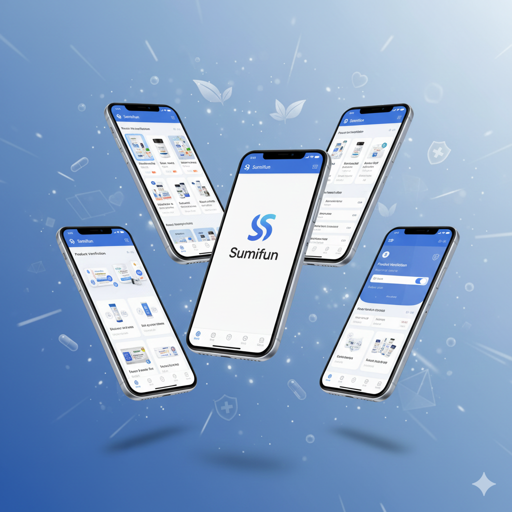

# 🚀 Sumifun – Multilingual Product Verification & Promotion Platform  
### Flutter Web + Firebase • Arabic • English • Chinese  
### Developed by **Ahmed Aljbry**

**Sumifun** is a modern enterprise-level platform built with **Flutter Web** and **Firebase**, offering secure product authenticity verification along with multilingual marketing and product-catalog capabilities.

The system is designed for global brands in the health & wellness sector and supports **3 languages** (Arabic, English, Chinese).  
It combines **verification**, **product catalog**, **ads/banners**, and a full **admin dashboard**.

---

## 🌟 Core Features

### 🧪 1. Product Authenticity Verification  
Users can verify products using:
- QR Code scanning  
- Manual serial number input  

The system displays:
- Product name  
- Production & expiry dates  
- Batch number  
- Verification status (Authentic / Suspicious / Fake)  
- First scan timestamp  
- Scan history (optional)

---

### 🌍 2. Multilingual Support (AR • EN • CN)

| Language | Region |
|---------|--------|
| Arabic  | Middle East / Gulf |
| English | Global |
| Chinese | China / Export partners |

All UI strings, product fields, and verification messages are fully localized.

---

### 📣 3. Professional Product Advertising System  
Brands can promote:
- Home banners  
- Featured products  
- Animated promotional cards  
- Discount sections  
- Product collections  

Sumifun is both a **verification system** and a **marketing platform**.

---

### 🏷 4. Product Catalog  
- Product list with images  
- Multi-language descriptions  
- Usage instructions  
- Category filters  
- Recommended items  

---

### 🛠 5. Admin Dashboard  
Admin can:
- Add / edit / delete products  
- Upload product images  
- Generate serials / QR codes  
- Create promotional banners  
- Manage AR/EN/CN translations  
- Track verification logs  
- View analytics  

---

### 🔐 6. Security & Anti-Tampering  
- Firestore security rules  
- Fake code detection  
- Attempt logging  
- Code reuse prevention  
- Protected admin routes  

---

### 🎨 7. Elegant UI / UX  
- Responsive for Web / Desktop / Mobile  
- Smooth animations  
- Corporate design style  
- High-quality product presentation  

---

## 🚀 Tech Stack

| Feature | Technology |
|--------|------------|
| Frontend | Flutter Web |
| Backend | Firebase Firestore + Functions |
| Hosting | Firebase Hosting |
| Auth | Firebase Authentication |
| Storage | Firebase Cloud Storage |
| Localization | flutter_localizations + custom JSON |
| Architecture | Feature-based modular structure |

---

## 🧱 Project Structure (Recommended)

